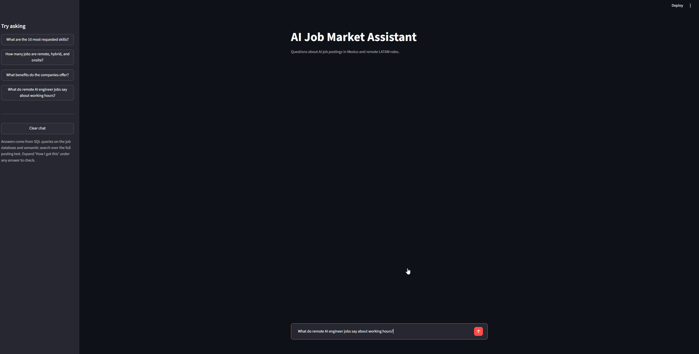
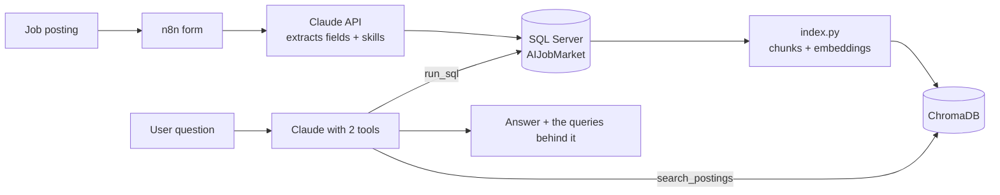

# AI Job Market Assistant

A chatbot that answers questions about AI job postings in Mexico and remote LATAM roles. It decides on its own whether a question needs a SQL query, a search through the posting text, or both, and it shows the query and search results behind every answer.

Ask things like:

- "What are the 5 most requested skills?" (SQL)
- "Which postings describe working directly with clients?" (text search)
- "What do remote AI engineer jobs say about working hours?" (SQL to find the jobs, then a search within just those)

## How it works

**1. Collection.** I paste a posting into an n8n form. Claude extracts the title, company, location, work mode, seniority, experience, language, salary and a standardized list of skills (so "PyTorch" stays PyTorch but "modelos de lenguaje", "GPT" and "Claude" all become "LLMs"). n8n writes everything to SQL Server, including the full posting text.

**2. Indexing.** `index.py` splits each posting into short chunks and embeds them with a multilingual model, so a search for "flexible schedule" also finds "horario flexible".

**3. Answering.** Claude gets the database schema and two tools. For counts, averages and filters it writes T-SQL; for anything that isn't a column (benefits, schedules, responsibilities) it searches the text. If a query fails, the error goes back to Claude and it fixes its own query.

## Evaluation

`eval.py` runs 19 test questions with known answers and uses Claude as a judge to compare each answer against the reference.

| Question type | Correct |
|---|---|
| SQL (counts, averages, joins, filters) | 15/15 |
| Text search (benefits, schedules, client work) | 3/4 |
| **Total** | **18/19 (95%)** |

SQL questions are checked against hand-written reference queries. Text questions are checked against facts I verified in the original postings.

The one failure: [explain what the time zone check showed, e.g. "the search missed the passage in the Azumo posting about US time zones" or "the expected answer was wrong: no posting mentions time zones, and an earlier chatbot answer had made it up"].

Full results: [`eval_results_20260925_1659.csv`](eval_results_20260925_1659.csv)

## Security

The chatbot runs model-written SQL against a real database, so permissions are enforced by the database, not just the prompt:

- `rag_reader` (used by the chatbot) can only `SELECT` from the two tables. A `DELETE` fails with a permission error.
- `n8n_writer` (used by the pipeline) can only `SELECT` and `INSERT`.
- Neither uses the admin account. Queries also time out after 30 seconds.

## Limitations

- **Small dataset.** 20 postings, so answers show patterns in this sample, not the whole market. Only 2 postings list a salary.
- **Search can't prove absence.** Text search returns the closest passages, not every posting, so the chatbot is instructed never to claim a posting doesn't mention something.
- **Selection bias.** I searched mostly for remote roles, which is why 17 of 20 are remote.

## Tech stack

Python, Claude API (tool use), SQL Server, n8n (self-hosted in Docker), ChromaDB, sentence-transformers (`paraphrase-multilingual-MiniLM-L12-v2`), Streamlit

## Run it yourself

1. Create the database and logins with [`schema.sql`](schema.sql).
2. Install dependencies: `pip install -r requirements.txt`
3. Copy `.env.example` to `.env` and fill in your values.
4. Add postings (through the n8n workflow or directly in SQL), then build the search index: `python index.py`
5. Start the app: `streamlit run app.py` (or `python ask.py` for the terminal version)
6. Run the evaluation: `python eval.py`

## Files

| File | What it does |
|---|---|
| `app.py` | Streamlit chat interface |
| `ask.py` | Claude + tools loop (also works in the terminal) |
| `search.py` | Semantic search over posting text |
| `index.py` | Builds the ChromaDB index |
| `db.py` | Read-only database connection |
| `eval.py`, `eval_questions.json` | Evaluation |
| `schema.sql` | Tables and logins |

Related project: [Job Market Analyzer](https://github.com/romelatg/AI-Powered-Job-Market-Analyzer) (the original n8n + Power BI pipeline for data analyst postings)
